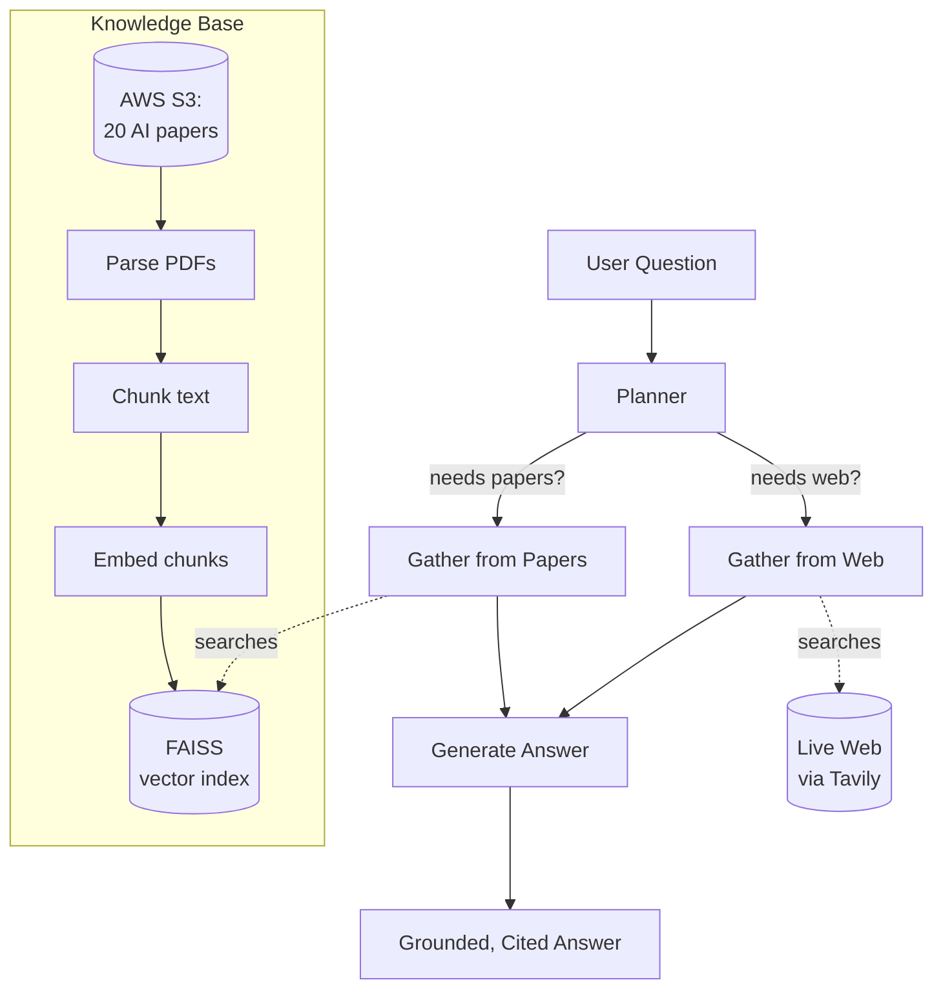

# Agentic RAG Research Assistant

A question-answering system that reads 20 foundational AI/ML research papers and answers questions about them in plain English — and when a question needs up-to-date information the papers don't have, it searches the live web instead. For harder questions that need both, it does both and combines the answer.

## What problem does this solve?

A regular AI chatbot can only answer from what it memorized during training. It can't read your specific documents, it can't cite its sources, and it confidently makes things up when it doesn't know ("hallucination"). This project fixes all three: every answer is grounded in real retrieved text, every answer cites where it came from, and when the information isn't available, the system says so instead of inventing an answer.

## How it works (the short version)

When you ask a question, the system first *plans* what it needs:
- A conceptual question like "how does attention work?" → it searches the 20 research papers.
- A current question like "what's the newest Llama model?" → it searches the live web.
- A question like "how does the newest Llama compare to the original transformer?" → it does both and synthesizes one answer bridging past and present.
- An off-topic question like "what's a good pasta recipe?" → it politely declines.

This decision-making — choosing the right tools for each question rather than always doing the same thing — is what makes it an *agent* rather than a fixed pipeline.

## Built with

Python, LangGraph (agent orchestration), FAISS (vector search), sentence-transformers (embeddings), Groq / Llama 3.3 (generation), Tavily (web search), and AWS S3 (document storage).

## Architecture



The system has two stages. The **knowledge base** (built once) turns 20 research papers into a searchable vector index. The **agent** (runs per question) plans which sources to use, gathers context, and synthesizes an answer.

### Walking through the diagram

**Building the knowledge base (happens once):**

The 20 research papers are stored in **AWS S3** as PDFs. A parser extracts the text from each PDF and cleans it up. Because a full paper is too large to search or feed to an AI all at once, the text is split into smaller overlapping **chunks** (about 1,500 characters each). Each chunk is then converted into an **embedding** — a list of numbers that captures the chunk's meaning — and all these embeddings are stored in a **FAISS index**, a structure that can find the most relevant chunks for any question in milliseconds. This whole stage runs once; after that, the searchable knowledge base just sits ready.

**Answering a question (happens every time):**

When a question comes in, the **Planner** decides which sources are needed — the papers, the live web, both, or neither. Then the **Gather** steps collect context: "Gather from Papers" searches the FAISS index for relevant chunks, and "Gather from Web" runs a live web search. Only the sources the planner asked for actually run. Finally, the **Generate** step takes all the gathered context and writes a single answer, grounded in that context and citing where each piece came from. If no sources were needed (an off-topic question), it politely declines instead of guessing.

The key idea: the system **decides what to do based on the question** instead of always doing the same thing. That decision-making is what makes it an *agent*.

## Getting started

### Prerequisites

- Python 3.12+
- API keys for [Groq](https://console.groq.com) (LLM, free tier) and [Tavily](https://tavily.com) (web search, free tier)
- An AWS account with an S3 bucket (for document storage)

### Setup

1. Clone the repository:
```bash
   git clone https://github.com/SaeeDesai/research-assistant.git
   cd research-assistant
```

2. Create and activate a virtual environment:
```bash
   python -m venv venv
   source venv/bin/activate        # On Windows: venv\Scripts\activate
```

3. Install dependencies:
```bash
   pip install -r requirements.txt
```

4. Set up environment variables. Copy `.env.example` to `.env` and fill in your keys:
```bash
   cp .env.example .env
```
   Then edit `.env` with your AWS, Groq, and Tavily credentials.

### Building the knowledge base

Download the papers, upload them to S3, and build the vector index:

```bash
python download_papers.py      # fetches 20 AI papers from arXiv
python upload_to_s3.py         # uploads them to your S3 bucket
python -m src.retrieval.vector_store   # builds and saves the FAISS index
```

### Asking questions

Run the agent:

```bash
python -m src.agent.graph
```

## Example queries

| Question | What the agent does |
|----------|---------------------|
| "What is LoRA and how does it reduce trainable parameters?" | Searches papers → answers from the LoRA paper |
| "What is the newest Llama model in 2026?" | Searches the live web → answers with current info |
| "How does the newest Llama compare to the original transformer?" | Searches **both** papers and web → synthesizes one answer |
| "What's a good recipe for pasta?" | Recognizes it's off-topic → politely declines |

## Project structure

```
research-assistant/
├── src/
│   ├── ingestion/        # S3 loading + PDF parsing
│   ├── chunking/         # recursive text chunking
│   ├── embeddings/       # sentence-transformer embeddings
│   ├── retrieval/        # FAISS vector store
│   ├── generation/       # RAG chain (retrieve + generate)
│   └── agent/            # LangGraph agent: planner, tools, graph
├── docs/                 # technical report + dev log
├── download_papers.py    # fetch papers from arXiv
├── upload_to_s3.py       # upload papers to S3
└── requirements.txt
```

## Key design decisions

A few choices worth highlighting (the full reasoning is in [docs/TECHNICAL_REPORT.md](docs/TECHNICAL_REPORT.md)):

- **Chunk size of ~1,500 characters with 200-character overlap** — large enough to hold a complete idea, small enough to stay precise. The overlap prevents losing concepts that fall on a chunk boundary.
- **`all-MiniLM-L6-v2` for embeddings** — runs locally for free, fast, and strong on semantic similarity. No per-call API cost when embedding thousands of chunks.
- **Planner with independent tool decisions, not a single router** — lets the agent use multiple sources for one question (e.g. comparing a 2017 paper to a 2026 model), which a single-choice router can't do.
- **Grounding-first prompting** — the system answers only from retrieved context and explicitly says when it doesn't know, rather than hallucinating from the model's training data.

## What I learned

This project was built to deeply understand modern AI engineering end-to-end: how raw documents become a searchable knowledge base, how semantic search actually works, how RAG grounds LLM answers, and how agentic systems plan and use tools. Every component was built from first principles rather than abstracted away, with a focus on understanding *why* each design choice was made.